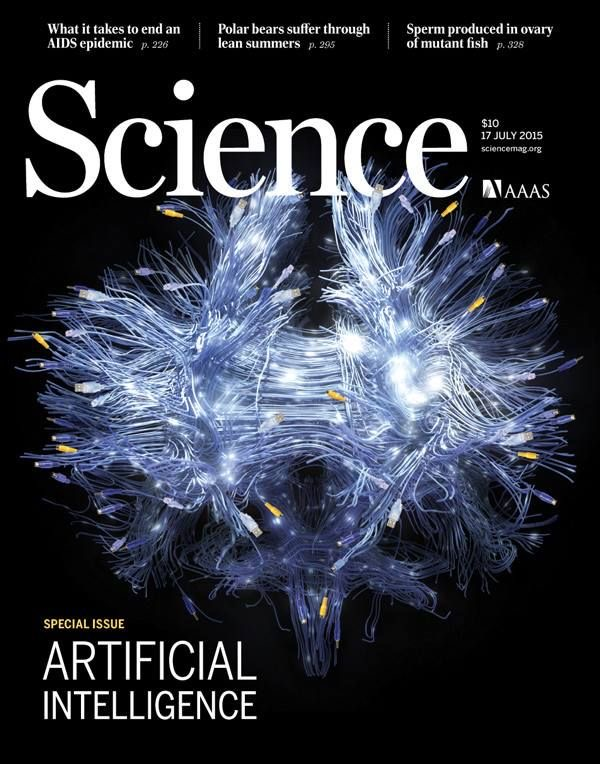

<h1> Notae Retis </h1>
Hello there, and welcome to my profile! This is Shamurikan.
<br/> <br/>

> [!NOTE]
> **web marks** *noun, plural* — digital indicators or saved references that mark and allow quick return to specific web locations.
        <a href="https://github.com/"></a>
Digital pointers or stored links that highlight distinct positions across the extensive structure of the internet.

# [FFmpeg](https://ffmpeg.org/) a complete, cross-platform solution to record, convert and stream audio and video.


```JS
ffmpeg -reconnect 1 -reconnect_at_eof 1 -reconnect_streamed 1 -reconnect_delay_max 10 -timeout 3000000 -i input.m3u8 -c copy output.mkv
```

```JS
ffmpeg -i file.m3u8 -c:v libx264 -preset ultrafast -crf 1 out.mkv
```

```JS
ffmpeg -i video.mp4 -vf "subtitles=subtitle_file.srt" -crf 1 output.mkv
```

## General

✦ [Ninja Nerd](https://www.ninjanerd.org/)

[AK Lectures](https://aklectures.com)

**YouTube Channels:**

✦ [Mediosis Perfectionalis](https://m.youtube.com/@MedicosisPerfectionalis)

✦ [Dirty Medicine](https://m.youtube.com/@DirtyMedicine)

[Dr. Najeeb](https://m.youtube.com/@DoctorNajeeb)

[Alila Medical Media](https://m.youtube.com/@Alilamedicalmedia)

## Anatomy

> [!NOTE]
> In biomedical sciences, anatomy is the branch of biology and medicine that studies the structure of organisms and their parts, focusing on the morphology, organization, and spatial relationships of bodily components at macroscopic and microscopic levels.

**Online Websites:**

[BioDigital](https://www.biodigital.com/)

**YouTube Channels:**

✦ [Dr. Ayman Khanfour](https://m.youtube.com/@Dr.Ayman_khanfour)

[Ken Hub](https://m.youtube.com/@Kenhub)

## Histology

> [!NOTE]
> In biomedical science, histology is the branch of anatomy and biology that studies the microscopic structure of cells, tissues, and organs, and the way these structures relate to their functions. It bridges anatomy (structure) and physiology (function) by showing how cellular and tissue organization underpins physiological processes.

**Online Websites:**

**YouTube Channels:**

[Dr. Iman Nabil](https://m.youtube.com/@dr.imannabil)

## Physiology

> [!NOTE]
> In scientific and medical terms, physiology is the branch of biology that investigates the mechanisms by which living systems function — from molecular and cellular processes to the coordination of organ systems — aiming to explain how organisms maintain homeostasis, adapt to change, and sustain life.

**Online Websites:**

**YouTube Channels:**

[Armando Hasudungan](https://m.youtube.com/@armandohasudungan)

[Physiology By Dr. Nagi](https://m.youtube.com/@PhysiologybyDoctorNagi)

[Khan Academy](https://m.youtube.com/@khanacademy)

## Biochemistry

**Online Websites:**

**YouTube Channels:**

✦ [Osmosis](https://m.youtube.com/@osmosis)

[Amoeba Sisters](https://m.youtube.com/@AmoebaSisters)

## Human Genetics

**Online Websites:**

**YouTube Channels:**

## Microbiology

**Online Websites:**

**YouTube Channels:**

✦ [Sketchy Learning](https://m.youtube.com/@SketchyLearning)

[ATP](https://m.youtube.com/@ATPPP)

[Dr. Hanady Alkott](https://m.youtube.com/@dr.hanadyalkott9538)

## Pathology

**Online Websites:**

**YouTube Channels:**

[Kevin Mangum, D.O.](https://m.youtube.com/@kevinmangum5340)

## Immunology

**Online Websites:**

**YouTube Channels:**

## Pharmacology

**Online Websites:**

[DrugBank](https://go.drugbank.com)

**YouTube Channels:**

✦ [AM Fouda](https://m.youtube.com/@AM_Fouda)

✦ [Speed Pharmacology](https://m.youtube.com/@SpeedPharmacology)

## Embryology

**Online Websites:**

**YouTube Channels:**

[Ahmed Farid](https://m.youtube.com/@ahmedfarid2010)

[Learn With Dr. Wahdan](https://m.youtube.com/@learnwithdr.wahdan3046/videos)

——

## Objective Structured Clinical Examination (OSCE)

**Online Websites:**

✦ [Geeky Medics](https://geekymedics.com)

**YouTube Channels:**

## Problem-Based Learning (PBL)

**Online Websites:**

**YouTube Channels:**

> [!NOTE]
> Useful information that users should know, even when skimming content.

> [!TIP]
> Helpful advice for doing things better or more easily.

> [!IMPORTANT]
> Key information users need to know to achieve their goal.

> [!WARNING]
> Urgent info that needs immediate user attention to avoid problems.

> [!CAUTION]
> Advises about risks or negative outcomes of certain actions.
